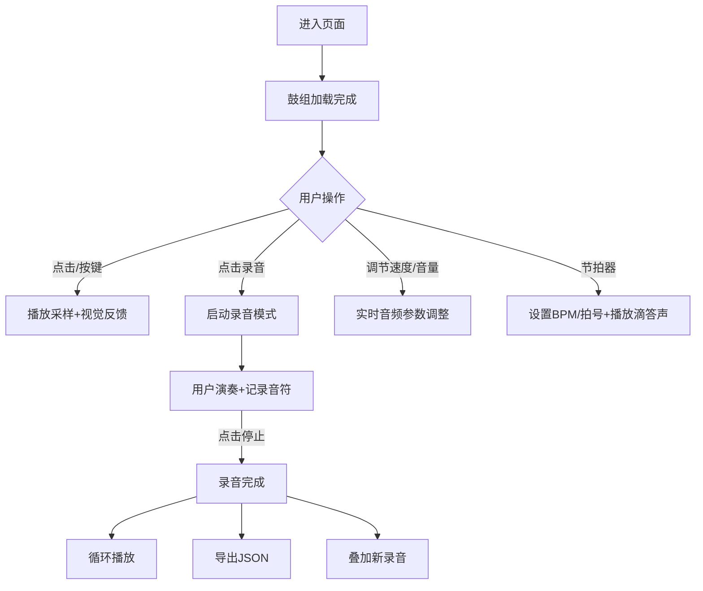

## 1. 产品概述
网页版电子鼓模拟器，让用户在浏览器中体验演奏架子鼓的乐趣，支持录音叠加、节拍器和节奏保存。
- 主要目的：为音乐爱好者提供一个便携、易用的虚拟架子鼓工具，可用于节奏练习、创作和分享。
- 目标用户：音乐爱好者、鼓手、音乐制作人、学生。
- 产品价值：无需实体乐器即可随时随地练习和创作鼓点节奏，支持保存和分享创作成果。

## 2. 核心功能

### 2.1 功能模块
1. **鼓组演奏界面**：五鼓四镲架子鼓可视化布局、点击/键盘触发采样、鼓垫视觉反馈
2. **录音与循环系统**：录制打击节奏、循环播放、实时叠加录音
3. **音频调节系统**：全局速度调节（变速不变调）、单鼓音量独立控制
4. **节拍器系统**：BPM设置、拍号设置、滴答声辅助
5. **节奏管理系统**：节奏导出为JSON、从JSON加载节奏

### 2.2 页面详情
| 页面名称 | 模块名称 | 功能描述 |
|-----------|-------------|---------------------|
| 主页（单页应用） | 鼓组区域 | 展示五鼓四镲布局，支持鼠标点击和键盘触发，触发时有视觉动效 |
| 主页 | 控制面板 | 录音、停止、循环播放按钮，录音状态指示 |
| 主页 | 速度控制 | 全局播放速度滑块（50%-200%），实时调速不变调 |
| 主页 | 音量控制 | 每个鼓垫独立的音量滑块，实时调节 |
| 主页 | 节拍器 | BPM输入/滑块，拍号选择，启停按钮，视觉节拍指示 |
| 主页 | 文件管理 | 导出JSON、导入JSON按钮，文件选择器 |
| 主页 | 键盘映射提示 | 显示各鼓垫对应的键盘按键 |

## 3. 核心流程

### 3.1 演奏流程
用户进入页面 → 点击鼓垫或按键盘 → 播放对应采样 → 鼓垫显示触发动画

### 3.2 录音流程
用户点击录音按钮 → 节拍器启动（可选） → 用户演奏 → 系统记录每个音符的时间和类型 → 用户点击停止 → 录音完成 → 可循环播放 → 可叠加新录音

### 3.3 节奏保存流程
用户完成录音创作 → 点击导出 → 下载JSON文件 → 下次可点击导入加载继续编辑

## 4. 用户界面设计

### 4.1 设计风格
- **整体风格**：深色工业风，模拟真实舞台灯光效果，具有专业DAW（数字音频工作站）的视觉质感
- **主色调**：深炭灰背景（#1a1a1e），霓虹蓝（#00d4ff）作为高亮色，霓虹橙（#ff6b35）作为录音警告色
- **辅助色**：金属银灰、哑光黑，鼓面使用渐变质感
- **按钮风格**：圆角方形，金属质感边框，按下时有凹陷效果和发光反馈
- **字体**：标题使用「Orbitron」未来感字体，正文使用「Roboto Mono」等宽字体
- **布局风格**：中心对称的鼓组布局，控制面板分布在上下两侧，类似真实电子鼓的控制界面
- **图标风格**：简洁的线性图标，带轻微发光效果

### 4.2 页面设计概述
| 页面名称 | 模块名称 | UI元素 |
|-----------|-------------|-------------|
| 主页 | 鼓组区域 | 圆形鼓垫带金属边框，悬停有光晕，触发时有缩放+发光动画，鼓面纹理渐变 |
| 主页 | 控制面板 | 发光按钮（录音红、播放绿、停止灰），LED风格状态指示灯 |
| 主页 | 滑块控件 | 深色轨道，霓虹色滑块，带刻度标识，数值实时显示 |
| 主页 | 节拍器 | 数字BPM显示屏风格，拍号下拉选择，视觉节拍指示灯 |
| 主页 | 键盘提示 | 鼓垫下方显示按键名称的小标签，圆角矩形 |
| 主页 | 背景 | 深色径向渐变，轻微噪点纹理，边缘有暗角效果 |

### 4.3 响应式
- Desktop-first设计，优先优化桌面端体验
- 移动端：鼓组自动缩小适配屏幕，触控区域优化
- 键盘提示在移动端隐藏，改用长按提示
- 控制面板采用流式布局，窄屏时垂直堆叠
