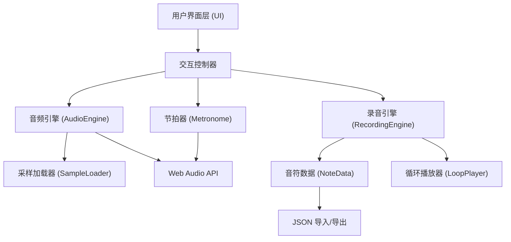

## 1. 架构设计



## 2. 技术描述
- **前端框架**：React@18 + TypeScript
- **构建工具**：Vite
- **样式方案**：TailwindCSS@3 + 自定义CSS
- **音频处理**：Web Audio API（原生），使用playbackRate实现调速不变调，使用GainNode实现音量控制
- **状态管理**：React hooks (useState, useRef, useEffect, useCallback)
- **无后端/无数据库**：纯前端单页应用，数据通过JSON文件本地存储和交换

## 3. 目录结构

```
src/
├── components/
│   ├── DrumPad.tsx          # 单个鼓垫组件
│   ├── DrumKit.tsx          # 整套架子鼓布局
│   ├── ControlPanel.tsx     # 录音/播放控制
│   ├── VolumeControls.tsx   # 音量控制面板
│   ├── SpeedControl.tsx     # 速度控制
│   ├── Metronome.tsx        # 节拍器组件
│   └── FileManager.tsx      # JSON导入导出
├── hooks/
│   ├── useAudioEngine.ts    # 音频引擎hook
│   ├── useRecording.ts      # 录音hook
│   └── useMetronome.ts      # 节拍器hook
├── utils/
│   ├── sampleLoader.ts      # 采样加载工具（使用在线免费采样或合成音）
│   ├── drumConfig.ts        # 鼓组配置（键位、音量、名称等）
│   └── audioUtils.ts        # 音频工具函数
├── types/
│   └── index.ts             # TypeScript类型定义
├── App.tsx
├── main.tsx
└── index.css
```

## 4. 核心数据结构

```typescript
// 单个鼓的配置
interface DrumConfig {
  id: string;
  name: string;
  key: string;          // 键盘映射
  keyCode: string;      // KeyboardEvent.code
  defaultVolume: number;// 0-1
  color: string;        // UI颜色
  position: { x: number; y: number }; // 在鼓组中的相对位置
  size: number;         // 鼓垫大小
}

// 录制的单个音符
interface Note {
  drumId: string;
  time: number;         // 相对于录音开始的毫秒数
  velocity: number;     // 力度 0-1
}

// 完整的节奏录音
interface RhythmData {
  version: string;
  name: string;
  createdAt: number;
  duration: number;     // 总时长（毫秒）
  bpm: number;          // 录制时的BPM
  timeSignature: string;// 拍号
  notes: Note[];
  drumVolumes: Record<string, number>; // 各鼓音量
}

// 录音状态
interface RecordingState {
  isRecording: boolean;
  isPlaying: boolean;
  isLooping: boolean;
  startTime: number;
  rhythm: RhythmData | null;
}
```

## 5. 关键技术实现

### 5.1 音频引擎
- 使用 `AudioContext` 管理所有音频节点
- 每个鼓对应一个 `GainNode` 实现独立音量控制
- 播放时创建 `BufferSource` 连接到对应 `GainNode`，再连接到主 `GainNode` → `destination`
- 调速：修改 `BufferSource.playbackRate`，不改变 `detune` 即保持音调

### 5.2 采样方案
- 优先使用在线免费的鼓采样（如 freesound.org 的CC0采样）
- 若网络不可用，使用 Web Audio API 的 `OscillatorNode` + 包络合成简单的鼓音色作为降级方案
- 采样使用 `BaseAudioContext.decodeAudioData()` 预加载

### 5.3 录音与叠加
- 录音开始时记录 `startTime = performance.now()`
- 每次触发鼓时记录 `{ drumId, time: now - startTime, velocity }`
- 叠加录音：循环播放已有录音时，继续记录新音符到同一 `notes` 数组
- 循环播放：使用 `setTimeout` 队列调度，或使用 `AudioContext` 的精确调度

### 5.4 节拍器
- 使用 `AudioContext.currentTime` 精确定时调度滴答声
- 强拍和弱拍使用不同频率或音量区分
- 视觉指示与音频同步

### 5.5 JSON导入导出
- 导出：创建 Blob → 创建下载链接 → 触发点击
- 导入：FileReader 读取文件 → JSON.parse → 验证数据结构 → 加载
